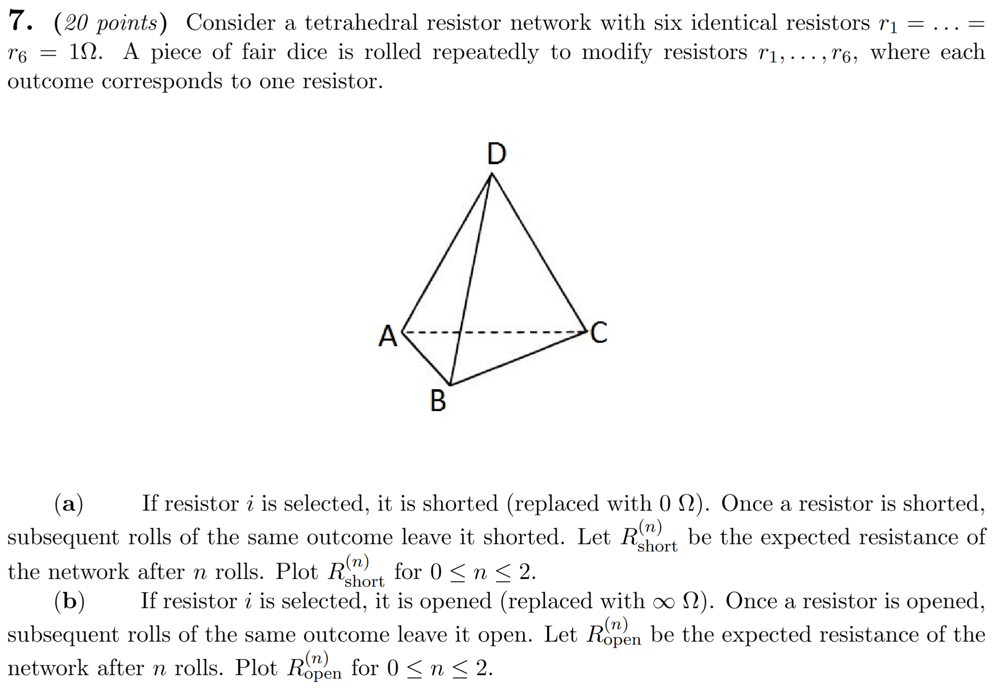

# 2025년도 1학기 KECE209-01 확률및랜덤프로세스 중간고사 7번 문항 시각화

고려대학교 2025년도 1학기 확랜프 중간고사 7번 문항에 대한 시각화를 하는 코드입니다.

## 문제 소개



업로드 허락 받음

## 구성

* **main.py**: n = 0, 1, 2일 때의 모든 경우의 회로 모양을을 `Img_main/` 폴더에 저장합니다.
* **resistance.py**: A와 B 노드 사이의 등가 저항을 계산하여 n = 0, 1, 2에서 개방(open) 및 단락(short) 케이스의 저항을 구하여여 `Img_resistance/` 폴더에 저장합니다.
* **answer.py**: 분수 형태의 등가 저항 계산으로 답안 그래프를 `answer.png`에 저장합니다.
* **main.ipynb** : 실행 편의를 위한 주피터 노트북.
* **Img\_main/**: `main.py` 실행 시 생성되는 회로의 시각화 결과 이미지가 저장됩니다.
* **Img\_resistance/**: `resistance.py` 실행 시 생성되는 회로와 합성저항 값 시각화 이미지가 저장됩니다.
* **answer.png** : `answer.py` 실행 시 생성되는 정답답 이미지가 저장됩니다.
* **requirements.txt**: Python 패키지 관리.
* **README.md**: 이 설명 파일.

## 실행 방법 (Colab)

1. Colab에 `main.ipynb`를 업로드 한다.
2. 왼쪽 사이드바에 있는 파일을 누른다
3. 세션 저장소에 업로드 버튼을 누른다
4. `main.py`, `resistance.py`, `answer.py`, `requirements.txt`를 업로드 한다.
5. 코드를 실행시킨다.
6. 파일에서 이미지가 생성된 것을 확인한다.

## 전제 조건

* Python 3.8 이상
* NetworkX
* NumPy
* Matplotlib
* Scipy

> ```bash
> pip install -r requirements.txt
> ```

## 라이선스

MIT 라이선스
